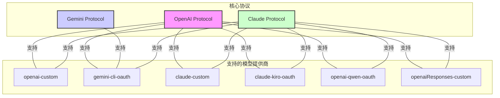

<div align="center">


# AIClient-2-API 🚀

**一个能将多种仅客户端内使用的大模型 API（Gemini CLI, Qwen Code Plus, Kiro Claude...），模拟请求，统一封装为本地 OpenAI 兼容接口的强大代理。**

</div>

<div align="center">

<a href="https://deepwiki.com/justlovemaki/AIClient-2-API"></a>

[](https://www.gnu.org/licenses/gpl-3.0)
[](https://nodejs.org/)
[](https://aiproxy.justlikemaki.vip/zh/docs/installation/docker-deployment.html)


[**中文**](./README-ZH.md) | [**English**](./README.md) | [**日本語**](./README-JA.md) | [**📚 完整文档**](https://aiproxy.justlikemaki.vip/zh/)

</div>

---

## 📋 项目概述

`AIClient2API` 是一个突破客户端限制的 HTTP 代理服务，将 Gemini CLI、Qwen Code Plus、Kiro Claude 等原本仅限客户端使用的免费大模型，转换为可供任何应用调用的标准 OpenAI 兼容接口。

### 🎯 核心使命

- **统一多个 AI API**：通过单一代理统一接入 OpenAI、Claude、Gemini、Ollama 等多个 AI 服务
- **提供负载均衡**：支持多账号池管理、智能轮询、自动故障转移和健康检查机制，确保 99.9% 的服务可用性
- **智能协议转换**：支持 OpenAI、Claude、Gemini 三大协议的智能互转，让任何工具都能调用任何模型

### ✨ 主要优势

| 优势 | 说明 |
|------|------|
| **统一接口** | 完全兼容 OpenAI API 规范，Cherry-Studio、NextChat、Cline 等工具无需修改即可使用 |
| **突破限制** | 利用 OAuth 授权机制，有效突破 Gemini 等服务的免费 API 速率和配额限制 |
| **免费高级模型** | 通过 Kiro API 模式免费使用 Claude Sonnet 4.5，通过 Qwen OAuth 模式使用 Qwen3 Coder Plus |
| **智能调度** | 支持多账号轮询、自动故障转移和配置降级 |

---

## 🌟 核心特性

### 🔄 多 Provider 支持和池管理

- **多模型统一接口**：支持 Gemini、Claude、GPT、Qwen Code、Kimi K2、GLM-4.6 等主流大模型
- **灵活切换机制**：支持通过启动参数、Path 路由、环境变量三种方式动态切换模型
- **账号池智能调度**：支持多账号轮询、自动故障转移和配置降级
- **提供商健康检查**：定期检测提供商状态，自动移除不健康的提供商

### 🌊 流式响应支持

- **实时数据流**：完全支持 HTTP 流式传输，实现实时响应
- **增量交互**：支持长文本逐字输出，改善用户体验
- **高效资源利用**：流式处理降低内存占用，支持大规模并发

### 🔐 OAuth 凭证管理

- **多种认证方式**：支持 Base64 编码、文件路径、环境变量等多种凭证配置方式
- **自动令牌刷新**：内置 OAuth 令牌自动刷新机制，无需手动管理
- **安全存储**：凭据文件加密存储，支持本地和云端配置

### 🔄 自动重试和健康检查机制

- **智能重试策略**：可配置的重试次数和延迟间隔，指数级退避算法
- **健康状态监控**：定期健康检查，自动隔离故障提供商
- **故障自动转移**：请求失败自动切换到备用提供商
- **可视化监控**：Web 管理控制台实时显示健康状态

### 🔀 协议转换策略

- **跨协议调用**：
  - 使用 OpenAI 协议调用 Claude 模型
  - 使用 Claude 协议调用 Gemini 模型
  - 支持任意两个协议间的相互转换
- **智能适配**：自动处理不同协议间的参数差异和响应格式
- **模型映射**：内置模型名称映射，自动适配不同提供商的模型命名

### 💻 Token 门控的 Web 管理控制台

#### 配置编辑
- **实时参数修改**：在线修改所有配置参数，立即生效
- **多提供商支持**：支持 Gemini CLI OAuth、OpenAI Custom、Claude Custom、Claude Kiro OAuth、Qwen OAuth 等
- **高级选项**：系统提示、日志配置、重试机制等高级选项

#### 凭证上传
- **集中管理**：所有 OAuth 凭据集中管理，支持搜索过滤
- **多格式支持**：支持 JSON 文件上传、Base64 编码、直接粘贴
- **自动验证**：上传前自动验证凭据有效性

#### Provider 池监控
- **实时监控**：查看各提供商账户状态、使用统计、错误率
- **启用/禁用管理**：支持动态启用或禁用提供商
- **性能指标**：显示活动连接数、使用次数、错误次数、最后使用时间等

#### 日志查看
- **实时日志**：系统日志和请求日志实时显示
- **灵活筛选**：支持按时间、级别、关键字筛选日志
- **导出功能**：支持日志导出和备份

#### 提示管理
- **系统提示编辑**：支持覆盖和追加两种模式
- **多提供商配置**：不同提供商可配置不同的系统提示
- **实时预览**：修改后即时预览效果

---

## 🛠️ 技术栈

### 核心技术
- **Node.js 20+ ESM**：现代 JavaScript 运行环境，完整 ES Module 支持
- **HTTP 代理架构**：高效的请求转发和协议适配
- **模块化设计**：基于策略模式和适配器模式的可扩展架构

### 测试框架
- **Jest**：现代化 JavaScript 测试框架
- **Supertest**：HTTP 断言库，便于 API 测试
- **集成测试**：覆盖率 90%+，确保代码质量

### 部署工具
- **Docker**：容器化部署，开箱即用
- **Docker Compose**：编排多个服务
- **跨平台支持**：Linux、macOS、Windows 无缝运行

### 其他技术
- **异步处理**：完整的 async/await 支持
- **流式处理**：HTTP 流、Server-Sent Events
- **实时通信**：WebSocket 和 Server-Sent Events
- **安全机制**：API Key 认证、OAuth 2.0 支持

---

## 🚀 快速开始

### 系统要求

- **Node.js**：v20.0.0 或更高版本
- **npm**：v10.0.0 或更高版本
- **操作系统**：Linux、macOS 或 Windows

### 方案一：使用自动化脚本（推荐）

#### Linux/macOS 用户
```bash
# 给脚本添加执行权限并运行
chmod +x install-and-run.sh
./install-and-run.sh
```

#### Windows 用户
```cmd
# 运行批处理文件
install-and-run.bat
```

#### 脚本功能
- ✅ 检查 Node.js 安装
- ✅ 自动安装 npm 依赖包
- ✅ 验证所有项目文件
- ✅ 在 `http://localhost:3000` 启动 API 服务器
- ✅ 自动打开管理控制台

### 方案二：Docker 部署

```bash
# 使用 Docker 运行
./run-docker.sh  # Linux/macOS
# 或
run-docker.bat   # Windows
```

### 方案三：手动安装

```bash
# 1. 克隆项目
git clone https://github.com/justlovemaki/AIClient-2-API.git
cd AIClient-2-API

# 2. 安装依赖
npm install

# 3. 启动服务
node src/api-server.js --port 3000 --api-key 123456

# 4. 访问管理控制台
# 浏览器打开 http://localhost:3000
```

### 首次使用

1. **访问管理控制台**：`http://localhost:3000`
2. **登录验证**：默认密码为 `admin123`（可在 `pwd` 文件中修改）
3. **配置提供商**：在"配置管理"选择并配置你的 AI 提供商
4. **开始使用**：复制"仪表盘"中的示例端点，即可开始调用

---

## 📡 API 使用示例

### 基础调用（OpenAI 协议）

使用 Gemini CLI OAuth 提供商：
```bash
curl http://localhost:3000/gemini-cli-oauth/v1/chat/completions \
  -H "Content-Type: application/json" \
  -H "Authorization: Bearer 123456" \
  -d '{
    "model": "gemini-2.0-flash-exp",
    "messages": [
      {"role": "user", "content": "Hello, how are you?"}
    ]
  }'
```

### Claude 协议调用

使用 Claude Kiro OAuth 提供商（免费 Claude Sonnet 4.5）：
```bash
curl http://localhost:3000/claude-kiro-oauth/v1/messages \
  -H "Content-Type: application/json" \
  -H "Authorization: Bearer 123456" \
  -d '{
    "model": "claude-sonnet-4.5",
    "max_tokens": 1024,
    "messages": [
      {"role": "user", "content": "Hello!"}
    ]
  }'
```

### 流式响应

支持流式输出，逐字返回响应：
```bash
curl http://localhost:3000/openai-custom/v1/chat/completions \
  -H "Content-Type: application/json" \
  -H "Authorization: Bearer 123456" \
  -d '{
    "model": "gpt-4",
    "messages": [{"role": "user", "content": "Write a poem"}],
    "stream": true
  }'
```

### 跨协议调用

使用 OpenAI 协议调用 Claude 模型：
```bash
curl http://localhost:3000/claude-custom/v1/chat/completions \
  -H "Content-Type: application/json" \
  -H "Authorization: Bearer 123456" \
  -d '{
    "model": "claude-3.5-sonnet",
    "messages": [{"role": "user", "content": "Hello!"}]
  }'
```

### Python 客户端示例

```python
from openai import OpenAI

client = OpenAI(
    api_key="123456",
    base_url="http://localhost:3000/gemini-cli-oauth"
)

response = client.chat.completions.create(
    model="gemini-2.0-flash-exp",
    messages=[
        {"role": "user", "content": "Hello, how are you?"}
    ]
)

print(response.choices[0].message.content)
```

### JavaScript/Node.js 示例

```javascript
import axios from 'axios';

const response = await axios.post(
  'http://localhost:3000/openai-custom/v1/chat/completions',
  {
    model: 'gpt-4',
    messages: [
      { role: 'user', content: 'Hello!' }
    ]
  },
  {
    headers: {
      'Authorization': 'Bearer 123456',
      'Content-Type': 'application/json'
    }
  }
);

console.log(response.data.choices[0].message.content);
```

---

## 🔧 配置文档

### 启动参数概览

| 分类 | 常用参数 | 说明 |
|------|--------|------|
| **服务器** | `--port` | 服务器监听端口，默认 3000 |
| | `--host` | 服务器监听地址，默认 localhost |
| | `--api-key` | API 认证密钥，默认 123456 |
| **提供商** | `--model-provider` | AI 模型提供商选择 |
| **认证** | `--openai-api-key` | OpenAI API 密钥 |
| | `--claude-api-key` | Claude API 密钥 |
| | `--gemini-oauth-creds-file` | Gemini OAuth 凭据文件 |
| **系统** | `--system-prompt-file` | 系统提示文件路径 |
| | `--log-prompts` | 提示日志模式 |

### 提供商配置

#### 支持的提供商类型

| 提供商 | 标识 | 用途 | 特点 |
|------|------|------|------|
| **Gemini CLI OAuth** | `gemini-cli-oauth` | 突破 Gemini 限制 | 免费、无配额限制 |
| **OpenAI Custom** | `openai-custom` | 官方 OpenAI API | 稳定、功能完整 |
| **Claude Custom** | `claude-custom` | 官方 Claude API | 高质量、费用较高 |
| **Claude Kiro OAuth** | `claude-kiro-oauth` | 免费 Claude | 免费、Sonnet 4.5 |
| **Qwen OAuth** | `openai-qwen-oauth` | 通义千问代码 | 免费、代码专用 |
| **OpenAI Responses** | `openaiResponses-custom` | 结构化输出 | 高级特性 |

### 详细启动参数

#### 🔧 服务器配置参数

| 参数 | 类型 | 默认值 | 说明 |
|------|------|--------|------|
| `--host` | string | localhost | 服务器监听地址 |
| `--port` | number | 3000 | 服务器监听端口 |
| `--api-key` | string | 123456 | 用于 API 身份验证的密钥 |

#### 🤖 模型提供商配置参数

| 参数 | 类型 | 默认值 | 说明 |
|------|------|--------|------|
| `--model-provider` | string | gemini-cli-oauth | AI 模型提供商，可选值：openai-custom, claude-custom, gemini-cli-oauth, claude-kiro-oauth, openai-qwen-oauth, openaiResponses-custom |

#### 🧠 OpenAI 兼容提供商参数

| 参数 | 类型 | 默认值 | 说明 |
|------|------|--------|------|
| `--openai-api-key` | string | null | OpenAI API 密钥 (当 `model-provider` 为 `openai-custom` 时必需) |
| `--openai-base-url` | string | null | OpenAI API 基础 URL (当 `model-provider` 为 `openai-custom` 时必需) |

#### 🖥️ Claude 兼容提供商参数

| 参数 | 类型 | 默认值 | 说明 |
|------|------|--------|------|
| `--claude-api-key` | string | null | Claude API 密钥 (当 `model-provider` 为 `claude-custom` 时必需) |
| `--claude-base-url` | string | null | Claude API 基础 URL (当 `model-provider` 为 `claude-custom` 时必需) |

#### 🔐 Gemini OAuth 认证参数

| 参数 | 类型 | 默认值 | 说明 |
|------|------|--------|------|
| `--gemini-oauth-creds-base64` | string | null | Gemini OAuth 凭据的 Base64 字符串 |
| `--gemini-oauth-creds-file` | string | null | Gemini OAuth 凭据 JSON 文件路径 |
| `--project-id` | string | null | Google Cloud 项目 ID (必需) |

#### 🎮 Kiro OAuth 认证参数

| 参数 | 类型 | 默认值 | 说明 |
|------|------|--------|------|
| `--kiro-oauth-creds-base64` | string | null | Kiro OAuth 凭据的 Base64 字符串 |
| `--kiro-oauth-creds-file` | string | null | Kiro OAuth 凭据 JSON 文件路径 |

#### 🐼 Qwen OAuth 认证参数

| 参数 | 类型 | 默认值 | 说明 |
|------|------|--------|------|
| `--qwen-oauth-creds-file` | string | null | Qwen OAuth 凭据 JSON 文件路径 (必需) |

#### 📝 系统提示配置参数

| 参数 | 类型 | 默认值 | 说明 |
|------|------|--------|------|
| `--system-prompt-file` | string | input_system_prompt.txt | 系统提示文件路径 |
| `--system-prompt-mode` | string | overwrite | 系统提示模式：overwrite（覆盖）、append（追加） |

#### 📊 日志配置参数

| 参数 | 类型 | 默认值 | 说明 |
|------|------|--------|------|
| `--log-prompts` | string | none | 提示日志模式：console（控制台）、file（文件）、none（无） |
| `--prompt-log-base-name` | string | prompt_log | 提示日志文件基础名称 |

#### 🔄 重试机制参数

| 参数 | 类型 | 默认值 | 说明 |
|------|------|--------|------|
| `--request-max-retries` | number | 3 | API 请求失败时，自动重试的最大次数 |
| `--request-base-delay` | number | 1000 | 自动重试之间的基础延迟时间（毫秒） |

#### ⏰ 定时任务参数

| 参数 | 类型 | 默认值 | 说明 |
|------|------|--------|------|
| `--cron-near-minutes` | number | 15 | OAuth 令牌刷新任务的间隔时间（分钟） |
| `--cron-refresh-token` | boolean | true | 是否开启 OAuth 令牌自动刷新任务 |

#### 🎯 号池配置参数

| 参数 | 类型 | 默认值 | 说明 |
|------|------|--------|------|
| `--provider-pools-file` | string | null | 提供商号池配置文件路径 |

### 启动命令示例

#### 基本启动
```bash
node src/api-server.js
```

#### 指定端口和 API 密钥
```bash
node src/api-server.js --port 8080 --api-key my-secret-key
```

#### 使用 OpenAI 提供商
```bash
node src/api-server.js \
  --model-provider openai-custom \
  --openai-api-key sk-xxx \
  --openai-base-url https://api.openai.com/v1
```

#### 使用 Claude 提供商
```bash
node src/api-server.js \
  --model-provider claude-custom \
  --claude-api-key sk-ant-xxx \
  --claude-base-url https://api.anthropic.com
```

#### 使用 Gemini OAuth（Base64 凭据）
```bash
node src/api-server.js \
  --model-provider gemini-cli-oauth \
  --gemini-oauth-creds-base64 eyJ0eXBlIjoi... \
  --project-id your-project-id
```

#### 使用 Gemini OAuth（凭据文件）
```bash
node src/api-server.js \
  --model-provider gemini-cli-oauth \
  --gemini-oauth-creds-file /path/to/credentials.json \
  --project-id your-project-id
```

#### 配置系统提示
```bash
node src/api-server.js \
  --system-prompt-file custom-prompt.txt \
  --system-prompt-mode append
```

#### 完整配置示例
```bash
node src/api-server.js \
  --host 0.0.0.0 \
  --port 3000 \
  --api-key my-secret-key \
  --model-provider gemini-cli-oauth \
  --project-id my-gcp-project \
  --gemini-oauth-creds-file ./credentials.json \
  --system-prompt-file ./custom-system-prompt.txt \
  --system-prompt-mode overwrite \
  --log-prompts file \
  --prompt-log-base-name api-logs \
  --provider-pools-file ./provider.json \
  --request-max-retries 5 \
  --request-base-delay 2000
```

---

## 🔗 模型提供商路由指南

### 路由切换机制

本项目提供灵活的模型切换方式，支持在 API 请求路径中指定提供商标识：

| 路由路径 | 协议 | 说明 | 适用场景 |
|---------|------|------|---------|
| `/claude-custom` | OpenAI / Claude | 使用配置文件中的 Claude API | 官方 Claude API 调用 |
| `/claude-kiro-oauth` | OpenAI / Claude | 通过 Kiro OAuth 访问 Claude | 免费使用 Claude Sonnet 4.5 |
| `/openai-custom` | OpenAI / Claude | 使用 OpenAI 提供商处理请求 | 标准 OpenAI API 调用 |
| `/gemini-cli-oauth` | OpenAI / Claude / Gemini | 通过 Gemini CLI OAuth 访问 | 突破 Gemini 免费限制 |
| `/openai-qwen-oauth` | OpenAI / Claude | 通过 Qwen OAuth 访问 | 使用 Qwen Code Plus |
| `/openaiResponses-custom` | OpenAI | OpenAI Responses API | 结构化对话场景 |

### 跨协议调用示例

#### 使用 OpenAI 协议调用不同模型

```bash
# 调用 Gemini
curl http://localhost:3000/gemini-cli-oauth/v1/chat/completions

# 调用 Claude  
curl http://localhost:3000/claude-custom/v1/chat/completions

# 调用 OpenAI
curl http://localhost:3000/openai-custom/v1/chat/completions
```

#### 使用 Claude 协议调用不同模型

```bash
# 调用 Gemini（Claude 协议）
curl http://localhost:3000/gemini-cli-oauth/v1/messages

# 调用 OpenAI（Claude 协议）
curl http://localhost:3000/openai-custom/v1/messages

# 调用 Claude
curl http://localhost:3000/claude-custom/v1/messages
```

---

## ⚙️ 授权配置指南

### Gemini CLI OAuth 配置

1. **获取 OAuth 凭据**
   - 访问 [Google Cloud Console](https://console.cloud.google.com/)
   - 创建项目，启用 Gemini API

2. **首次授权**
   - 使用 Gemini 服务后，命令行会打印 Google 授权页面
   - 复制页面到浏览器授权
   - 授权完成后返回命令行

3. **凭据存储**
   - 授权成功后，`oauth_creds.json` 文件自动生成
   - 存储位置：`~/.gemini/oauth_creds.json`

4. **项目配置**
   - 需要提供有效的 Google Cloud 项目 ID
   - 通过启动参数 `--project-id` 指定

### Qwen Code OAuth 配置

1. **首次授权**
   - 启动服务后，系统自动在浏览器打开授权页面

2. **凭据存储**
   - 授权成功后，`oauth_creds.json` 文件自动生成
   - 存储位置：`~/.qwen/oauth_creds.json`

3. **推荐参数**
   ```json
   {
     "temperature": 0,
     "top_p": 1
   }
   ```

### Kiro API 配置

1. **环境准备**
   - [下载并安装 Kiro 客户端](https://aibook.ren/archives/kiro-install)

2. **完成授权**
   - 在客户端中登录账号
   - 生成 `kiro-auth-token.json` 凭据文件

3. **最佳实践**
   - 推荐配合 **Claude Code** 使用
   - 获得最优体验

4. **重要提示**
   - 请访问 Kiro 官方网站查看最新使用限制和条款

### 账号池管理配置

1. **创建号池配置文件**
   - 参考 [provider.json.example](./provider.json.example)

2. **配置号池参数**
   - 在 config.json 中设置 `PROVIDER_FILE_PATH`
   - 指向号池配置文件

3. **启动参数配置**
   - 使用 `--provider-pools-file <path>` 参数

4. **健康检查**
   - 系统定期自动执行健康检查
   - 自动移除不健康的提供商

### 授权文件存储位置

| 服务 | 默认路径 | 说明 |
|------|---------|------|
| **Gemini** | `~/.gemini/oauth_creds.json` | OAuth 认证凭据 |
| **Kiro** | `~/.aws/sso/cache/kiro-auth-token.json` | Kiro 认证令牌 |
| **Qwen** | `~/.qwen/oauth_creds.json` | Qwen OAuth 凭据 |

> **说明**：`~` 表示用户主目录（Windows: `C:\Users\用户名`，Linux/macOS: `/home/用户名` 或 `/Users/用户名`）

---

## 🎨 模型协议与提供商关系图

本项目通过不同的协议（Protocol）支持多种模型提供商（Model Provider）。以下是它们之间的关系概述：

*   **OpenAI 协议 (P_OPENAI)**：由 `openai-custom`, `gemini-cli-oauth`, `claude-custom`, `claude-kiro-oauth` 和 `openai-qwen-oauth` 等模型提供商实现。
*   **Claude 协议 (P_CLAUDE)**：由 `claude-custom`, `claude-kiro-oauth`, `gemini-cli-oauth`, `openai-custom` 和 `openai-qwen-oauth` 等模型提供商实现。
*   **Gemini 协议 (P_GEMINI)**：由 `gemini-cli-oauth` 模型提供商实现。

### 关系图表



---

## 📊 Web 管理控制台功能详解

### 🎨 界面设计

- **响应式设计**：完美支持桌面、平板和移动设备
- **现代化界面**：采用最新设计规范，提供卓越的用户体验
- **侧边栏导航**：快速切换各功能模块
- **协议标签切换**：支持 OpenAI/Claude 协议快速切换

### 📊 仪表盘功能

- **系统概览**：运行时间、Node.js 版本、内存使用率等
- **统计信息**：活动连接数、活跃提供商、健康提供商数量
- **路由示例**：直观的跨协议调用示例
- **客户端配置**：为各类客户端提供配置指南

### ⚙️ 配置管理功能

- **实时修改**：修改配置立即生效（部分参数除外）
- **多提供商支持**：轻松切换和配置不同的 AI 提供商
- **高级选项**：系统提示、日志、重试机制、令牌刷新等
- **配置验证**：自动验证配置有效性

### 🔗 提供商池管理

- **状态监控**：实时显示各提供商的活跃状态
- **性能指标**：使用次数、错误率、最后使用时间等
- **启用/禁用**：动态管理提供商可用性
- **健康统计**：显示健康和不健康的提供商数量

### 📁 上传配置管理

- **集中管理**：所有 OAuth 凭据集中管理
- **搜索过滤**：快速定位目标配置文件
- **关联状态**：显示配置文件关联状态
- **文件操作**：上传、删除、查看等操作

### 📜 实时日志查看

- **实时显示**：系统日志实时推送到前端
- **灵活筛选**：支持按时间、级别、关键字筛选
- **导出功能**：支持日志导出和备份
- **性能优化**：自动滚动和缓冲区管理

### 🔐 安全保护

- **Token 门控**：默认密码 `admin123`，可自定义
- **API 认证**：所有 API 端点都需要有效的 API Key
- **凭据加密**：敏感信息加密存储
- **会话管理**：支持自动登出和会话管理

---

## 🎯 高级功能

### MCP 协议支持

本项目完全兼容 **Model Context Protocol (MCP)**，可与支持 MCP 的客户端无缝集成。

### 多模态输入能力

支持以下多种输入类型：
- 文本输入
- 图片上传和识别
- 文档解析
- 音频转文本

### 最新模型支持

无缝支持以下最新大模型：
- **Claude Sonnet 4.5** - Anthropic 最新旗舰模型
- **Gemini 3** - Google 最新预览版模型
- **GPT-4 Turbo** - OpenAI 最新模型
- **Qwen Code Plus** - 阿里通义千问代码专用模型
- **Kimi K2** - 月之暗面最新旗舰模型
- **GLM-4.5** - 智谱 AI 最新版本

### 全链路日志记录

- **完整追踪**：捕获所有请求和响应数据
- **审计支持**：支持审计、调试
- **数据集构建**：基于日志数据快速构建专属训练数据集

### 系统提示词管理

- **双重模式**：支持覆盖和追加两种模式
- **灵活配置**：实现统一基础指令与个性化扩展的完美结合
- **提供商级别**：不同提供商可配置不同的系统提示

---

## 🏗️ 项目架构

### 核心模块

| 模块 | 职责 | 文件 |
|------|------|------|
| **API 服务器** | 启动和配置管理 | `api-server.js` |
| **请求处理** | 路由和请求转发 | `request-handler.js` |
| **配置管理** | 参数配置和管理 | `config-manager.js` |
| **提供商池** | 账号池管理和调度 | `provider-pool-manager.js` |
| **协议转换** | 跨协议适配和转换 | `convert.js`, `adapter.js` |
| **UI 管理** | Web 控制台服务 | `ui-manager.js` |

### 适配器架构

- **Gemini 适配器**：处理 Gemini API 请求
- **OpenAI 适配器**：处理 OpenAI 兼容请求
- **Claude 适配器**：处理 Claude API 请求
- **Ollama 适配器**：处理 Ollama 兼容请求

### 设计模式

- **策略模式**：灵活切换不同的 Provider 策略
- **适配器模式**：协议转换和格式适配
- **单例模式**：全局配置和服务管理
- **观察者模式**：实时事件推送

---

## 💾 项目文件结构

```
.
├── src/                        # 源代码目录
│   ├── api-server.js          # API 服务器主文件
│   ├── request-handler.js     # 请求处理器
│   ├── config-manager.js      # 配置管理
│   ├── provider-pool-manager.js # 提供商池管理
│   ├── ui-manager.js          # UI 管理服务
│   ├── convert.js             # 协议转换
│   ├── adapter.js             # 协议适配器
│   ├── common.js              # 公共工具
│   ├── claude/                # Claude 相关模块
│   ├── gemini/                # Gemini 相关模块
│   ├── openai/                # OpenAI 相关模块
│   ├── converters/            # 转换器集合
│   └── img/                   # 图片资源
├── static/                     # 前端静态资源
│   ├── index.html             # 主页面
│   └── app/                   # 前端应用
├── tests/                      # 测试文件
├── config.json                # 配置文件
├── provider.json.example      # 提供商配置示例
├── models.json                # 模型配置
├── jest.config.js             # Jest 配置
├── Dockerfile                 # Docker 镜像定义
├── install-and-run.sh         # 自动启动脚本（Linux/macOS）
├── install-and-run.bat        # 自动启动脚本（Windows）
├── run-docker.sh              # Docker 运行脚本（Linux/macOS）
└── run-docker.bat             # Docker 运行脚本（Windows）
```

---

## 🐳 Docker 部署

### 快速启动

```bash
# 使用自动化脚本
chmod +x run-docker.sh
./run-docker.sh

# 或手动使用 Docker
docker build -t aiclient2api .
docker run -p 3000:3000 -e API_KEY=123456 aiclient2api
```

### Docker Compose 部署

支持 Docker Compose 编排，详见项目中的相关配置文件。

---

## 📝 版本更新日志

> [!NOTE]
> **🎉 重要里程碑**
>
> - 感谢阮一峰老师在 [周刊 359 期](https://www.ruanyifeng.com/blog/2025/08/weekly-issue-359.html) 的推荐

**最近更新**：
- **2025.11.11** - 新增 Web UI 管理控制台，支持实时配置管理和健康状态监控
- **2025.11.06** - 新增对 Gemini 3 预览版的支持，增强模型兼容性和性能优化
- **2025.10.18** - Kiro 开放注册，新用户赠送 500 额度，已完整支持 Claude Sonnet 4.5
- **2025.09.01** - 集成 Qwen Code CLI，新增 `qwen3-coder-plus` 模型支持
- **2025.08.29** - 发布账号池管理功能，支持多账号轮询、智能故障转移和自动降级策略

---

## 📚 相关文档

- [Web UI 管理控制台详细文档](./UI_README.md) - 查看完整的 UI 功能说明
- [提供商配置示例](./provider.json.example) - 提供商池配置模板
- [官方完整文档](https://aiproxy.justlikemaki.vip/zh/) - 查看更多详细信息

---

## 📄 开源许可

本项目遵循 [**GNU General Public License v3 (GPLv3)**](https://www.gnu.org/licenses/gpl-3.0) 开源许可。详情请查看根目录下的 `LICENSE` 文件。

---

## 🙏 致谢

本项目的开发受到了官方 Google Gemini CLI 的极大启发，并参考了 Cline 3.18.0 版本 `gemini-cli.ts` 的部分代码实现。在此对 Google 官方团队和 Cline 开发团队的卓越工作表示衷心的感谢！

---

## 🌟 Star History

[](https://www.star-history.com/#justlovemaki/AIClient-2-API&Timeline)

---

## ⚠️ 免责声明

### 使用风险提示
本项目（AIClient-2-API）仅供学习和研究使用。用户在使用本项目时，应自行承担所有风险。作者不对因使用本项目而导致的任何直接、间接或 consequential 损失承担责任。

### 第三方服务责任说明
本项目是一个 API 代理工具，不提供任何 AI 模型服务。所有 AI 模型服务由相应的第三方提供商（如 Google、OpenAI、Anthropic 等）提供。用户在使用本项目访问这些第三方服务时，应遵守各第三方服务的使用条款和政策。作者不对第三方服务的可用性、质量、安全性或合法性承担责任。

### 数据隐私说明
本项目在本地运行，不会收集或上传用户的任何数据。但用户在使用本项目时，应注意保护自己的 API 密钥和其他敏感信息。建议用户定期检查和更新自己的 API 密钥，并避免在不安全的网络环境中使用本项目。

### 法律合规提醒
用户在使用本项目时，应遵守所在国家/地区的法律法规。严禁将本项目用于任何非法用途。如因用户违反法律法规而导致的任何后果，由用户自行承担全部责任。

---

## 📮 联系与支持

- **GitHub Issues**：提交 Bug 或功能建议
- **Pull Requests**：欢迎贡献代码
- **官方文档**：[https://aiproxy.justlikemaki.vip/zh/](https://aiproxy.justlikemaki.vip/zh/)
- **DeepWiki**：[https://deepwiki.com/justlovemaki/AIClient-2-API](https://deepwiki.com/justlovemaki/AIClient-2-API)

---

**祝您使用愉快！🎉**
